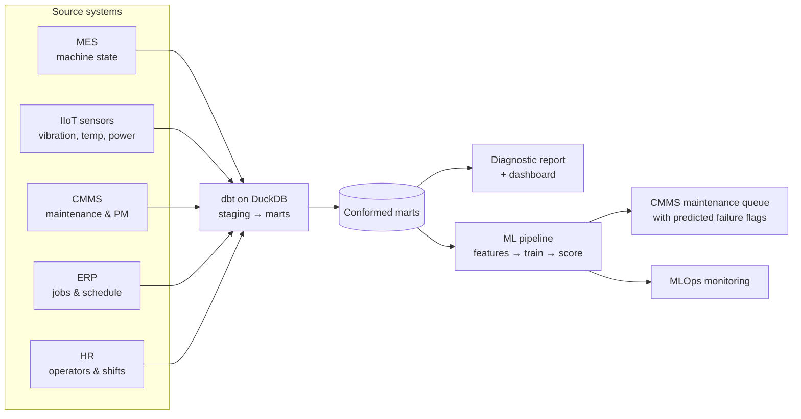

# Manufacturing Data Platform: OEE, Machine Health & Predictive Maintenance

**An end-to-end data platform for a mid-sized manufacturer, spanning data engineering, analytics and machine learning, applied to machine health and unplanned downtime.**

It starts with a **data pipeline** that integrates machine, sensor, maintenance and order data from five disconnected systems into a single modeled dataset.

An **analytics and ML layer** is then built on top of that integrated dataset, including:

1. **Analytics diagnostics report** that uncovers where OEE is lost and what drives unplanned downtime
2. **KPI dashboard** that tracks OEE, reliability and maintenance, laid out by week and month
3. **Machine learning model** that predicts each machine's remaining time to its next unplanned failure and flags it before it happens, supported by technical documentation and MLOps monitoring in production

The machine learning model's failure predictions are embedded into the company's existing CMMS, as shown below:

[](https://brimsystems.github.io/mfg-oee-downtime/docs/index.html)

> **[Open the live CMMS maintenance queue &rarr;](https://brimsystems.github.io/mfg-oee-downtime/docs/index.html)** &nbsp;·&nbsp; **[All six deliverables &rarr;](https://brimsystems.github.io/mfg-oee-downtime/)**

---

## Business Context

A precision machining shop running twelve CNC machines across three cells was losing production hours to unplanned failures. To date, maintenance ran on a fixed calendar: every machine was serviced on the same interval whether it needed it or not, so healthy machines were serviced too often while the aging ones still failed between visits.

The data that could anticipate those failures was already being captured, just split across five disconnected systems: machine state in the MES, condition-monitoring sensors on every spindle, maintenance and PM history in the CMMS, job and schedule data in the ERP, and operator records in HR. Integrating these disparate systems revealed the conditions that precede a breakdown, for example an aging machine with rising alarm counts and spindle vibration running well past its scheduled PM.

Going forward, each machine's time to its next likely failure is estimated before it happens, and the reasons behind the flag are visible while there is still time to schedule the work, order the part or move the job.

---

## Deliverables

| # | Deliverable | What it is | Links |
|---|---|---|---|
| 1 | CMMS maintenance queue | The model embedded in a Limble-style asset view: each machine's predicted days to next failure, OEE health and maintenance priority, ranked by urgency. | [View](https://brimsystems.github.io/mfg-oee-downtime/docs/index.html) |
| 2 | Analytics diagnostic report | Where OEE is lost across availability, performance and quality, the downtime Pareto, PM compliance, and the cross-system conditions that drive failures. | [View](https://brimsystems.github.io/mfg-oee-downtime/docs/reports/analytics_report.html) |
| 3 | KPI dashboard | The recurring weekly and monthly view of OEE, MTBF and MTTR, and PM compliance by machine, with historical trends. | [View](https://brimsystems.github.io/mfg-oee-downtime/docs/reports/dashboard.html) |
| 4 | ML model overview & performance report | A high-level model summary: what the model predicts, how it performs, the downtime it helps avoid, and its limits. | [View](https://brimsystems.github.io/mfg-oee-downtime/docs/reports/model_overview.html) |
| 5 | ML technical report | Feature engineering, target construction, the time-based split, hyperparameter tuning, residual analysis, and calibration. | [View](https://brimsystems.github.io/mfg-oee-downtime/docs/reports/technical_report.html) |
| 6 | MLOps monitoring report | Monitoring across periods on four layers (performance, target, prediction, and feature drift) with a rules-based retraining decision. | [View](https://brimsystems.github.io/mfg-oee-downtime/docs/reports/monitoring_report.html) |

---

## How it works



Raw extracts from the five source systems, with the integration problems that come with them (an operator ID that differs between HR and the ERP, machine state logged every 15 minutes against job records that carry only start and end times, PM dates that have to be reconciled), are combined by a tested dbt pipeline into conformed marts. Those marts feed the analytics report and dashboard and the ML pipeline. The data is split by time into training, validation, and test sets; three candidate regressors are tuned and the best is registered. Scoring runs as a monthly batch, and each period is monitored against training and validation references.

---

## Data

The datasets were generated to represent typical records from the source systems involved (MES, IIoT sensors, CMMS, ERP, and HR), so the full workflow can be demonstrated on data that is safe to share publicly; the [generators are in `data_source/generate/`](data_source/generate/).

---

## Running it locally

```bash
# 1. Environment
python3 -m venv .venv
source .venv/bin/activate          # Windows: .venv\Scripts\activate
pip install -e .                   # project + dependencies from pyproject.toml

# 2. Generate data and build the warehouse
python3 -m data_source.generate.run_generator
cd data_pipeline && dbt build && cd ..

# 3. Analytics (diagnostic report + dashboard)
cd analytics/reports && python3 generate_analytics_report.py && cd ../..
cd analytics/dashboard && python3 generate_dashboard.py && cd ../..

# 4. ML lifecycle (train -> score -> monitor)
cd ml
python3 src/training.py            # trains, selects, registers the production model
python3 src/scoring.py             # monthly batch scoring with SHAP drivers
python3 src/monitoring.py          # four-layer drift and performance monitoring
cd ..

# 5. Client-facing report generators
cd ml/reports
python3 generate_cmms_dashboard.py
python3 generate_model_overview.py
python3 generate_ml_technical.py
python3 generate_monitoring_report.py
cd ../..
```

The report generators write standalone HTML; the copies served by GitHub Pages live under [`docs/`](docs/).

---

## Stack

| Layer | Tools |
|---|---|
| Integration & transformation | dbt, DuckDB |
| Analytics & reporting | Python, pandas, matplotlib, seaborn, HTML/CSS |
| Modeling | XGBoost, scikit-learn, Optuna, SHAP |
| MLOps | MLflow (tracking & registry), Evidently (drift), Prefect (orchestration) |
| Delivery | Static HTML, GitHub Pages |

---

Brian Davis, fractional data engineering and analytics partner for SMB manufacturers &middot; brian@brimsystems.com
