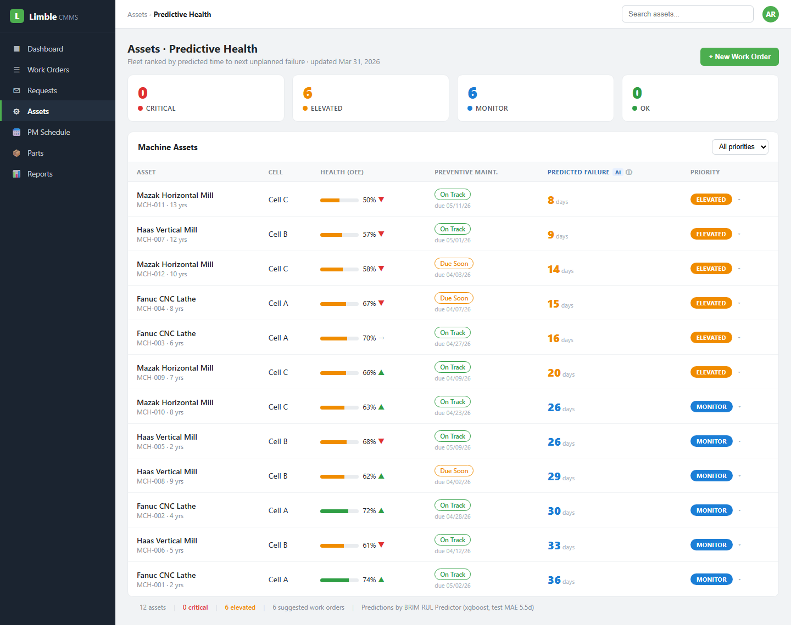
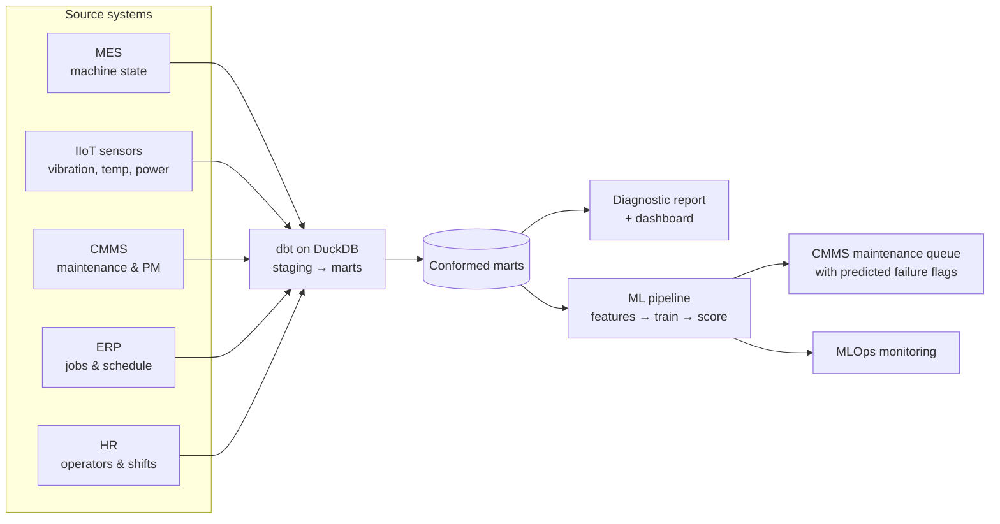

# Manufacturing Data Platform: OEE, Machine Health & Predictive Maintenance

**An end-to-end data platform for a mid-sized manufacturer, spanning data engineering, analytics and machine learning, applied to OEE, machine health and predictive maintenance.**

It starts with a **data pipeline** that integrates machine, sensor, maintenance and order data from five disconnected systems into a single modeled dataset.

An **analytics and ML layer** is then built on top of that integrated dataset, including:

1. **Analytics diagnostics report** that uncovers where OEE is lost and what drives unplanned downtime
2. **KPI dashboard** that tracks OEE, reliability and maintenance, laid out by week and month
3. **Machine learning model** that predicts each machine's remaining time to its next unplanned failure and flags it before it happens, enabling predictive maintenance. Supported by technical documentation and MLOps monitoring in production

The machine learning model's failure predictions are embedded into the company's existing CMMS, as shown below:

[](https://brimsystems.github.io/mfg-oee-downtime/docs/index.html)

> **[Open the live CMMS maintenance queue &rarr;](https://brimsystems.github.io/mfg-oee-downtime/docs/index.html)** &nbsp;·&nbsp; **[All six deliverables &rarr;](https://brimsystems.github.io/mfg-oee-downtime/)**

---

## Business Context

A precision machining shop (~$40M revenue) ran twelve CNC machines with almost no monitoring in place. Availability and cycle-time performance went unmeasured, and machine downtime was recorded only after the fact, without a dependable account of its cause or its cost. As a result, maintenance ran on a fixed calendar, servicing every machine at the same interval, so healthy machines lost production time to service they did not need while unplanned failures continued at elevated rates.

To close that gap, the shop fitted condition-monitoring sensors to every machine. On their own, the readings say little. Integrated with machine state, work-order and maintenance history from the MES, ERP and CMMS, they support two things at once. The first is a true OEE picture, with availability, performance and quality measured for each machine. The second is visibility into the conditions that precede a breakdown, which a machine learning model converts into a predicted time to failure, enabling preventive maintenance.

The shop can now see where its production hours go and which losses are worth addressing first. Maintenance runs against machine condition rather than the calendar, with enough lead time to schedule the work or move the job to another machine. Taken together, machine capacity becomes better optimized and maintenance that used to be unplanned becomes scheduled.

---

## Deliverables

| # | Deliverable | What it is | Links |
|---|---|---|---|
| 1 | CMMS maintenance queue | The predictive maintenance model embedded in the shop's CMMS: each machine's predicted days to next failure, OEE health and maintenance priority, ranked by urgency. | [View](https://brimsystems.github.io/mfg-oee-downtime/docs/index.html) |
| 2 | Analytics diagnostic report | Where OEE is lost across availability, performance and quality, the downtime Pareto, PM compliance, and the cross-system conditions that drive failures. | [View](https://brimsystems.github.io/mfg-oee-downtime/docs/reports/analytics_report.html) |
| 3 | KPI dashboard | The recurring weekly and monthly view of OEE, machine reliability and maintenance compliance by machine, with historical trends. | [View](https://brimsystems.github.io/mfg-oee-downtime/docs/reports/dashboard.html) |
| 4 | ML model overview & performance report | A high-level model summary: what the model predicts, how it performs, the downtime it helps avoid, and its limits. | [View](https://brimsystems.github.io/mfg-oee-downtime/docs/reports/model_overview.html) |
| 5 | ML technical report | Feature engineering, target construction, the time-based split, hyperparameter tuning, residual analysis, and calibration. | [View](https://brimsystems.github.io/mfg-oee-downtime/docs/reports/technical_report.html) |
| 6 | MLOps monitoring report | Monitoring across periods on four layers (performance, target, prediction, and feature drift) with a rules-based retraining decision. | [View](https://brimsystems.github.io/mfg-oee-downtime/docs/reports/monitoring_report.html) |

---

## Code

### Data pipeline: [`data_pipeline/models/`](data_pipeline/models/)

| Layer | What it is, does and contains |
|---|---|
| Staging | One model per source table across MachineMetrics, the ERP, the CMMS, HR and the machine sensors. Each cleans, types and renames a single raw extract into a consistent shape, without joining across systems. |
| Intermediate | Conforms the staged tables into shared dimensions (machines, operators, shifts) and facts (machine run, idle and down states, and maintenance and failure events). |
| Marts | The analysis-ready tables the reports and model read: OEE and machine performance, downtime analysis, PM compliance, operator setup, and the remaining-useful-life feature table. |

### Machine learning model: [`ml/src/`](ml/src/)

| File | What it does |
|---|---|
| `features.py` | Builds the model features from the conformed marts. |
| `training.py` | Trains and tunes the candidate regressors, then selects and registers the best. |
| `scoring.py` | Runs batch scoring for each machine's time to next failure. |
| `monitoring.py` | Four-layer drift and performance monitoring against reference windows. |

---

## How it works



Raw extracts from the five source systems, with the integration problems that come with them (an operator ID that differs between HR and the ERP, machine state logged every 15 minutes against job records that carry only start and end times, PM dates that have to be reconciled), are combined by a tested dbt pipeline into conformed marts. Those marts feed the analytics report and dashboard and the ML pipeline. The data is split by time into training, validation, and test sets; three candidate regressors are tuned and the best is registered. Scoring runs as a monthly batch, and each period is monitored against training and validation references.

---

## Data

The datasets were generated to represent typical records from the source systems involved (MES, IIoT sensors, CMMS, ERP, and HR), so the full workflow can be demonstrated on data that is safe to share publicly; the [generators are in `data_source/generate/`](data_source/generate/).

---

## Running it locally

```bash
# 1. Environment
python3 -m venv .venv
source .venv/bin/activate          # Windows: .venv\Scripts\activate
pip install -e .                   # project + dependencies from pyproject.toml

# 2. Generate data and build the warehouse
python3 -m data_source.generate.run_generator
cd data_pipeline && dbt build && cd ..

# 3. Analytics (diagnostic report + dashboard)
cd analytics/reports && python3 generate_analytics_report.py && cd ../..
cd analytics/dashboard && python3 generate_dashboard.py && cd ../..

# 4. ML lifecycle (train -> score -> monitor)
cd ml
python3 src/training.py            # trains, selects, registers the production model
python3 src/scoring.py             # monthly batch scoring with SHAP drivers
python3 src/monitoring.py          # four-layer drift and performance monitoring
cd ..

# 5. Client-facing report generators
cd ml/reports
python3 generate_cmms_dashboard.py
python3 generate_model_overview.py
python3 generate_ml_technical.py
python3 generate_monitoring_report.py
cd ../..
```

The report generators write standalone HTML; the copies served by GitHub Pages live under [`docs/`](docs/).

---

## Stack

| Layer | Tools |
|---|---|
| Integration & transformation | dbt, DuckDB |
| Analytics & reporting | Python, pandas, matplotlib, seaborn, HTML/CSS |
| Modeling | XGBoost, scikit-learn, Optuna, SHAP |
| MLOps | MLflow (tracking & registry), Evidently (drift), Prefect (orchestration) |
| Delivery | Static HTML, GitHub Pages |

---

Brian Davis, fractional data engineering and analytics partner for SMB manufacturers &middot; brian@brimsystems.com
